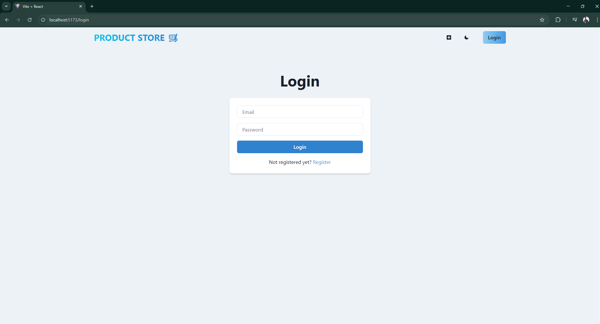

<h1>🛒 MERN E-Commerce Website</h1>

<h2>📌 Description</h2>

The MERN E-Commerce Website is a full-stack web application built with the 
<strong>MERN stack (MongoDB, Express, React, Node.js)</strong> that allows users to register, log in, and manage products. 
The project supports full CRUD operations for products and integrates authentication for user management.

<h3>🔑 Key Features:</h3>
<ul>
  <li>User authentication system with registration & login.</li>
  <li>Secure password hashing with <strong>bcryptjs</strong>.</li>
  <li>Email verification system using <strong>Nodemailer</strong>.</li>
  <li>CRUD operations for products (Create, Read, Update, Delete).</li>
  <li>Product management with real-time UI updates using <strong>Zustand</strong>.</li>
  <li>Responsive design for smooth usage across all devices.</li>
</ul>

<h2>🛠️ Technologies Used</h2>
<ul>
  <li><strong>MongoDB</strong> → NoSQL database for storing users & products.</li>
  <li><strong>Express.js</strong> → Backend framework for API development.</li>
  <li><strong>React.js</strong> → Frontend framework for user interface.</li>
  <li><strong>Node.js</strong> → Runtime environment for server-side code.</li>
  <li><strong>Zustand</strong> → Lightweight state management for React.</li>
  <li><strong>Chakra UI</strong> → UI component library for styling.</li>
  <li><strong>Nodemailer</strong> → Email service for sending verification emails.</li>
  <li><strong>Bcrypt.js</strong> → For password hashing.</li>
  <li><strong>CORS & Middleware</strong> → To handle secure API requests.</li>
</ul>

<h2>⚙️ How to Run the Project</h2>

<h3>1️⃣ Install Prerequisites</h3>
<ul>
  <li>Node.js (v18 or higher recommended)</li>
  <li>npm or yarn</li>
  <li>MongoDB (local or Atlas cloud)</li>
</ul>

<h3>2️⃣ Clone the Repository</h3>
<pre><code>https://github.com/Abtahe103/E-Commerce_Website_MERN.git</code></pre>

<h3>3️⃣ Navigate to the Project Directory</h3>
<pre><code>cd E-Commerce_Website_MERN</code></pre>

<h3>4️⃣ Install Dependencies</h3>

<b>For backend:</b>

<pre><code>cd backend
npm install</code></pre>

<b>For frontend:</b>

<pre><code>cd frontend
npm install</code></pre>

<h3>5️⃣ Setup Environment Variables</h3>

Create a <code>.env</code> file inside the <b>backend</b> folder:

<pre><code>MONGO_URI=your_mongodb_connection_string
PORT=5000
JWT_SECRET=your_secret_key
EMAIL_USER=your_email@gmail.com
EMAIL_PASS=your_app_password
EMAIL_FROM_NAME="MERN Shop"
CLIENT_URL=http://localhost:5173</code></pre>

<h3>6️⃣ Run the Development Servers</h3>

<b>Start backend:</b>

<pre><code>cd backend
npm run dev
</code></pre>

By default → <code>http://localhost:5000</code>

<b>Start frontend:</b>

<pre><code>cd frontend
npm run dev
</code></pre>

By default → <code>http://localhost:5173</code>

<h2>📷 Website Screenshots</h2>

<h3>🏠 Home Page</h3>

  
  
<em>Fig 1: Website Homepage</em>

<h3>🔑 Login Page</h3>

  
  
<em>Fig 2: Login Page</em>

<h3>📝 Register Page</h3>

  
  
<em>Fig 3: Register Page</em>

<h3>➕ Create Product Page</h3>

  
  
<em>Fig 4: Create Product Page</em>

<h3>✏️ Update Product Page</h3>

  
  
<em>Fig 5: Update Product Page</em>

